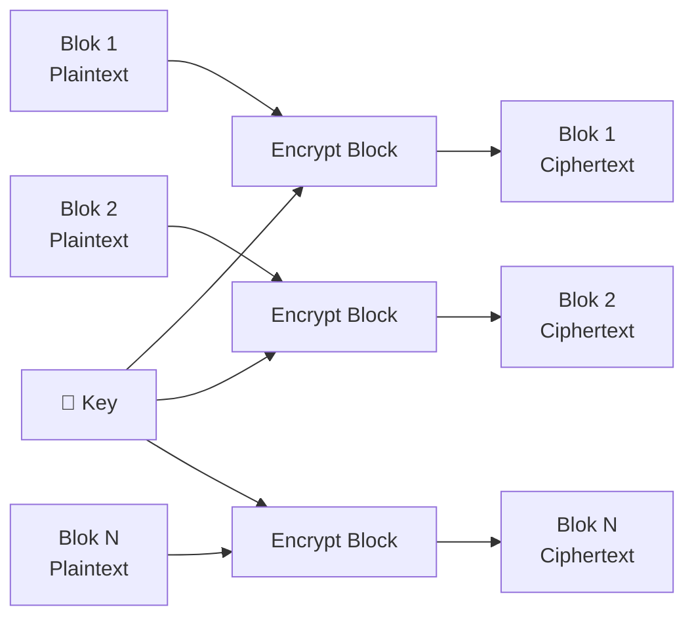
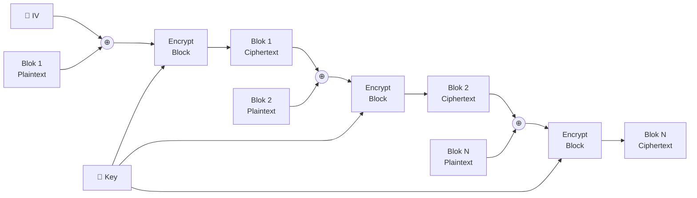
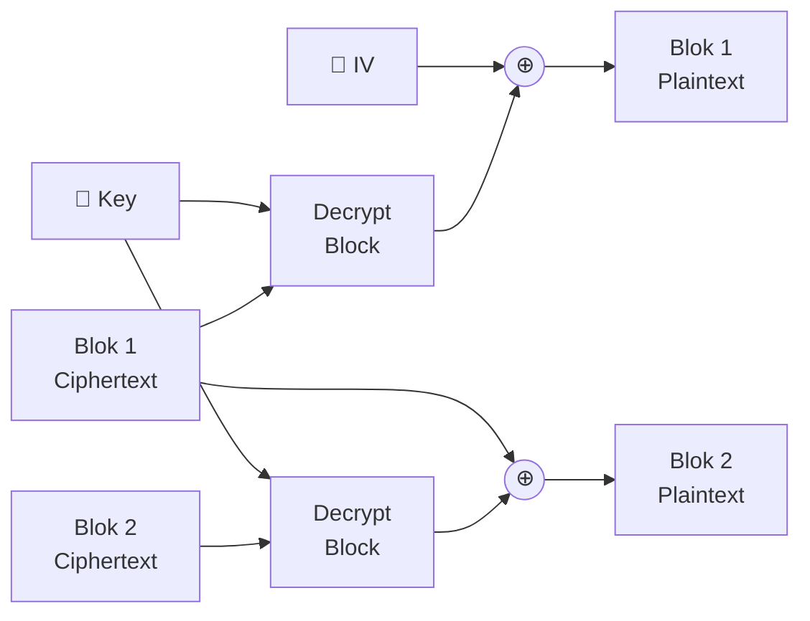

# 📦 Dokumentasi Block Cipher

Implementasi block cipher kustom **tanpa library kriptografi eksternal** yang mendukung dua mode enkripsi: **ECB** dan **CBC**.

> [!IMPORTANT]
> Implementasi ini identik di dua tempat dan harus selalu sinkron:
> - **TypeScript** → `lib/block-cipher.ts` (digunakan oleh Next.js web app)
> - **Python** → `block_cipher.py` (digunakan untuk demo/testing CLI)

---

## Konstanta & Konfigurasi

| Konstanta | Nilai | Keterangan |
|-----------|-------|------------|
| `BLOCK_SIZE` | `16` | Ukuran setiap blok dalam byte (128-bit), sesuai standar AES |

---

## Utility Functions

### `pad_key` / `padKey`

Mengubah kunci string sembarang menjadi tepat **16 byte** dengan metode cyclic repetition.

```
"secret" → s e c r e t s e c r e t s e c r
            0 1 2 3 4 5 6 7 8 9 ...        15
```

- Jika key kosong → diisi `0xAA` sebanyak 16 byte (fallback key)
- Jika key lebih pendek → diulang sampai 16 byte
- Jika key lebih panjang → dipotong di byte ke-16

---

### `block_pad` / `pkcs7Pad` — PKCS#7 Padding

Menambahkan padding pada data agar panjangnya selalu kelipatan 16.

**Contoh:**  Data = `HELLO` (5 byte) → perlu padding 11 byte

```
H  E  L  L  O  0B 0B 0B 0B 0B 0B 0B 0B 0B 0B 0B
```

> Nilai byte padding = jumlah byte yang ditambahkan (`0x0B` = 11).  
> Selalu ditambahkan bahkan jika data sudah kelipatan 16 — akan menambah 1 blok penuh `0x10`.

---

### `block_unpad` / `pkcs7Unpad`

Membuang padding: baca byte terakhir sebagai panjang padding, lalu potong.

---

---

## Mode 1 — ECB (Electronic Codebook)

> [!NOTE]
> **Pipeline Enkripsi:** `Substitusi → Rotasi-Kiri-3 → Transposisi`  
> **Pipeline Dekripsi:** `Undo-Transposisi → Rotasi-Kanan-3 → Undo-Substitusi`

### Cara Kerja ECB

Setiap blok 16 byte dienkripsi **secara independen** dengan kunci yang sama. Tidak ada hubungan antar blok.



### Algoritma Per-Blok (Enkripsi ECB)

#### Step 1 — Substitusi (Add & Modulo)

Setiap byte dari blok ditambah dengan byte kunci yang bersesuaian, lalu diambil modulo 256.

```
out[i] = (block[i] + key[i]) % 256
```

| Byte | Plaintext | Key  | Hasil |
|------|-----------|------|-------|
| 0    | 72 (`H`)  | 115 (`s`) | 187  |
| 1    | 69 (`E`)  | 101 (`e`) | 170  |
| ...  | ...       | ...  | ...   |

#### Step 2 — Rotasi (Circular Shift Left, shift = 3)

Seluruh array byte digeser secara sikular ke kiri sebanyak **3 posisi**.

```
Input:  [A B C D E F G H I J K L M N O P]
Output: [D E F G H I J K L M N O P A B C]
          ^--- posisi 3 menjadi posisi 0
```

```
rot[i] = sub[(i + 3) % 16]
```

#### Step 3 — Transposisi (Matriks 4×4)

Blok 16 byte diperlakukan sebagai matriks 4×4 yang dibaca **per baris**, lalu keluarannya dibaca **per kolom**.

```
Pola: [0, 4, 8, 12, 1, 5, 9, 13, 2, 6, 10, 14, 3, 7, 11, 15]

Matrix input (baca baris):     Matrix output (baca kolom):
 0  1  2  3                     0  4  8 12
 4  5  6  7          →          1  5  9 13
 8  9 10 11                     2  6 10 14
12 13 14 15                     3  7 11 15
```

```
out[i] = rot[TRANSPOSE_PATTERN[i]]
```

---

### Algoritma Per-Blok (Dekripsi ECB)

Semua langkah dibalik dalam urutan terbalik:

1. **Undo Transposisi** → tulis byte ke posisi pola, bukan baca dari posisi pola
   ```
   rot[TRANSPOSE_PATTERN[i]] = block[i]
   ```
2. **Undo Rotasi** → geser ke kanan 3 (ekuivalen dengan `subOut[(i+3)%16] = rot[i]`)
3. **Undo Substitusi** → kurangi key (mod 256, ditambah 256 agar tidak negatif)
   ```
   out[i] = (sub[i] - key[i] + 256) % 256
   ```

---

---

## Mode 2 — CBC (Cipher Block Chaining)

> [!NOTE]
> **Pipeline Enkripsi per blok:** `XOR-Substitusi → Rotasi-Kiri-5 → Pairwise-Swap+NOT`  
> **Pipeline Dekripsi per blok:** `Undo Swap+NOT → Rotasi-Kanan-5 → Undo-XOR-Substitusi`

### Cara Kerja CBC

Setiap blok plaintext di-**XOR** terlebih dahulu dengan blok ciphertext sebelumnya (atau IV untuk blok pertama), sebelum dienkripsi. Ini membuat setiap blok ciphertext **bergantung pada semua blok sebelumnya**.



### Algoritma Per-Blok (Enkripsi CBC)

Blok yang masuk ke fungsi ini sudah melalui XOR dengan prev-cipher/IV terlebih dahulu.

#### Step 1 — Substitusi (XOR dengan Key)

```
sub[i] = block[i] XOR key[i]
```

Berbeda dengan ECB yang menggunakan penambahan, CBC menggunakan **XOR** — operasi yang simetris (inverse-nya sama persis).

#### Step 2 — Rotasi (Circular Shift Left, shift = 5)

Geser array byte secara sirkular ke kiri **5 posisi**.

```
Input:  [A B C D E F G H I J K L M N O P]
Output: [F G H I J K L M N O P A B C D E]
```

```
rot[i] = sub[(i + 5) % 16]
```

> [!TIP]
> Shift = **5** dipilih untuk CBC agar berbeda dari ECB (shift = **3**), sehingga kedua mode memiliki karakteristik difusi yang berbeda.

#### Step 3 — Permutasi (Pairwise Swap + Bitwise NOT)

Setiap pasangan byte ditukar posisinya, lalu masing-masing diinvert (bitwise NOT).

```
Pasangan (0,1): out[0] = ~rot[1],  out[1] = ~rot[0]
Pasangan (2,3): out[2] = ~rot[3],  out[3] = ~rot[2]
...
```

```
out[i]   = (~rot[i+1]) & 0xFF      # tukar dan NOT
out[i+1] = (~rot[i])   & 0xFF
```

> [!NOTE]
> Operasi **Swap+NOT bersifat self-inverse** — menjalankan fungsi yang sama dua kali mengembalikan nilai asal. Karena itu kode enkripsi dan dekripsi untuk langkah ini **identik**.

---

### Algoritma Per-Blok (Dekripsi CBC)

Dijalankan dalam urutan terbalik:

1. **Undo Permutasi** (kode identik — self-inverse)
2. **Undo Rotasi** → geser kanan 5
   ```
   sub[(i + 5) % 16] = rot[i]
   ```
3. **Undo Substitusi** (XOR simetris — kode identik)
   ```
   out[i] = sub[i] XOR key[i]
   ```

Setelah blok didekripsi, hasil di-XOR dengan blok ciphertext asli sebelumnya (atau IV):



---

---

## Perbandingan ECB vs CBC

| Aspek | ECB | CBC |
|-------|-----|-----|
| **Input tambahan** | Key saja | Key + IV |
| **Hubungan antar blok** | ❌ Independen | ✅ Berrantai |
| **Step 1** | Substitusi (Add + Mod 256) | Substitusi (XOR key) |
| **Step 2** | Rotasi kiri 3 | Rotasi kiri **5** |
| **Step 3** | Transposisi matriks 4×4 | Pairwise Swap + NOT |
| **Keamanan pola** | ⚠️ Blok identik → ciphertext identik | ✅ Pola tersembunyi oleh chaining |
| **Parallelisasi enkripsi** | ✅ Bisa paralel | ❌ Harus urut |
| **Parallelisasi dekripsi** | ✅ Bisa paralel | ✅ Bisa paralel |

---

---

## API Reference

### TypeScript — `lib/block-cipher.ts`

```typescript
// Konstanta
export const BLOCK_SIZE: number                                           // = 16

// Konversi
export function stringToBytes(str: string): Uint8Array
export function bytesToString(bytes: Uint8Array): string
export function bytesToHex(bytes: Uint8Array): string
export function hexToBytes(hex: string): Uint8Array

// Key & Padding
export function padKey(keyStr: string): Uint8Array                       // → 16-byte key
export function pkcs7Pad(data: Uint8Array): Uint8Array
export function pkcs7Unpad(data: Uint8Array): Uint8Array

// ECB Mode
export function encryptECB(data: Uint8Array, keyStr: string, usePadding: boolean): Uint8Array
export function decryptECB(data: Uint8Array, keyStr: string, usePadding: boolean): Uint8Array

// CBC Mode
export function encryptCBC(data: Uint8Array, keyStr: string, ivStr: string, usePadding: boolean): Uint8Array
export function decryptCBC(data: Uint8Array, keyStr: string, ivStr: string, usePadding: boolean): Uint8Array
```

**Contoh penggunaan (TypeScript):**
```typescript
import { encryptECB, decryptECB, encryptCBC, decryptCBC,
         stringToBytes, bytesToString, bytesToHex, hexToBytes } from "@/lib/block-cipher"

const key = "MYSECRETKEY"
const iv  = "MYINITIALVECT"
const plaintext = "HELLO WORLD"

// ECB Encrypt
const ecbCipher = encryptECB(stringToBytes(plaintext), key, true)
console.log(bytesToHex(ecbCipher))  // → hex string

// ECB Decrypt
const ecbPlain = decryptECB(hexToBytes(hexString), key, true)
console.log(bytesToString(ecbPlain)) // → "HELLO WORLD"

// CBC Encrypt
const cbcCipher = encryptCBC(stringToBytes(plaintext), key, iv, true)

// CBC Decrypt
const cbcPlain = decryptCBC(cbcCipher, key, iv, true)
```

---

### Python — `block_cipher.py`

```python
BLOCK_SIZE: int = 16

# Utility
def pad_key(key_str: str) -> bytes
def block_pad(data: bytes) -> bytes
def block_unpad(data: bytes) -> bytes
def bytes_to_hex(data: bytes) -> str
def hex_to_bytes(hex_str: str) -> bytes
def xor_blocks(a: bytes, b: bytes) -> bytes

# ECB Mode
def encrypt_ecb(data: bytes, key_str: str, use_padding: bool) -> bytes
def decrypt_ecb(data: bytes, key_str: str, use_padding: bool) -> bytes

# CBC Mode
def encrypt_cbc(data: bytes, key_str: str, iv_str: str, use_padding: bool) -> bytes
def decrypt_cbc(data: bytes, key_str: str, iv_str: str, use_padding: bool) -> bytes
```

**Contoh penggunaan (Python):**
```python
from block_cipher import encrypt_ecb, decrypt_ecb, encrypt_cbc, decrypt_cbc

key = "MYSECRETKEY"
iv  = "MYINITIALVECT"
plaintext = "HELLO WORLD"

# ECB
cipher = encrypt_ecb(plaintext.encode("utf-8"), key, use_padding=True)
plain  = decrypt_ecb(cipher, key, use_padding=True)
assert plain.decode("utf-8") == plaintext

# CBC
cipher = encrypt_cbc(plaintext.encode("utf-8"), key, iv, use_padding=True)
plain  = decrypt_cbc(cipher, key, iv, use_padding=True)
assert plain.decode("utf-8") == plaintext
```

**Jalankan self-test:**
```bash
python block_cipher.py
```

---

## Catatan Teknis

> [!WARNING]
> Ini adalah implementasi **custom/edu** — tidak menggunakan standar kriptografi mapan (AES, ChaCha20, dll). **Jangan gunakan untuk data sensitif di production.**

- Algoritma ECB dan CBC ini dibuat untuk keperluan **tugas/demonstrasi** konsep block cipher
- Ukuran blok 16 byte (128-bit) dipilih sesuai dengan standar AES sehingga familiar
- PKCS#7 padding digunakan agar kompatibel dengan konvensi yang umum
- Shift berbeda (3 vs 5) antara ECB dan CBC dimaksudkan agar kedua mode memiliki sifat difusi yang berbeda, bukan identik
